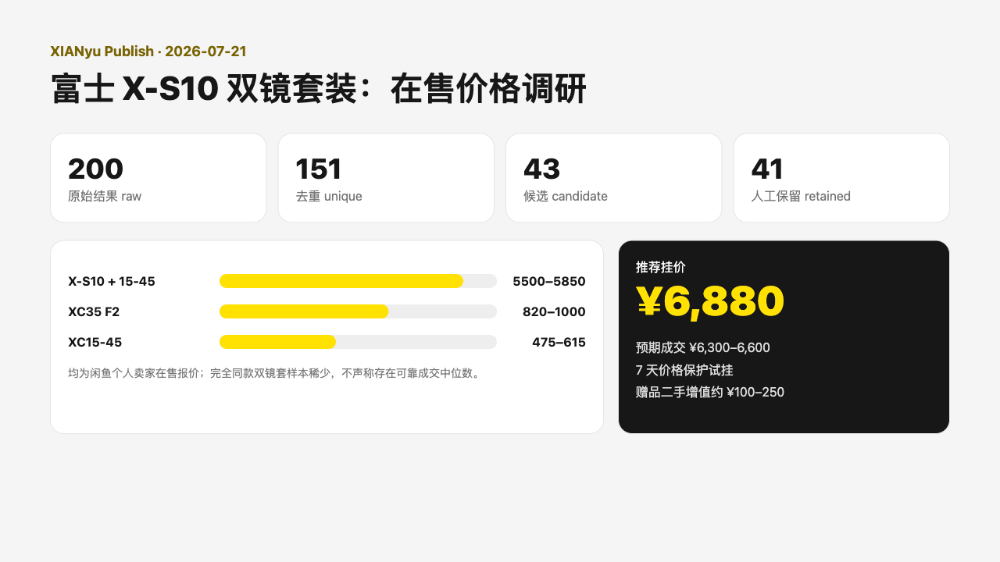
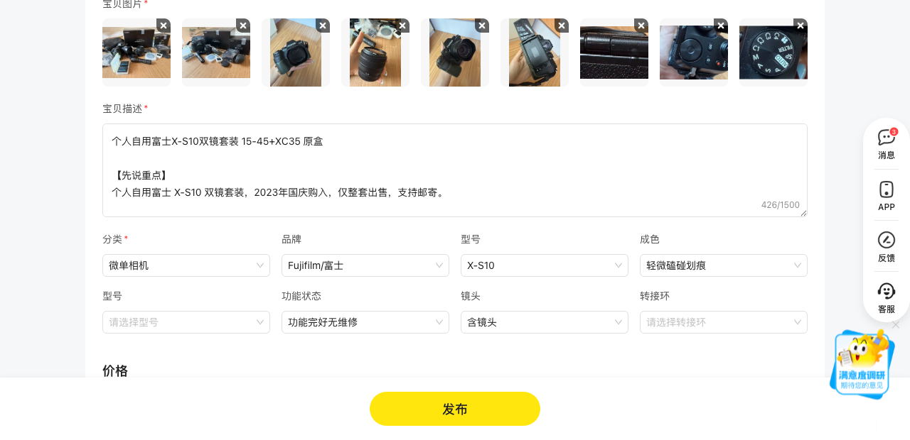
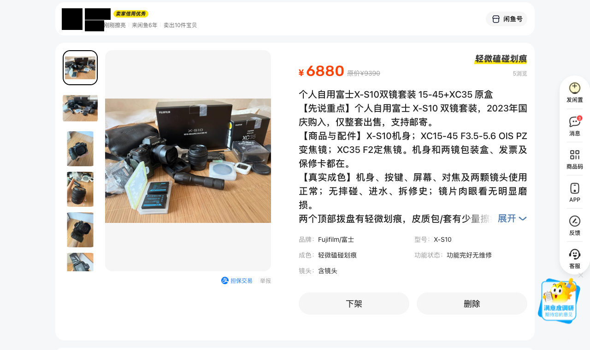

# 实际案例：富士 X-S10 双镜套装

这是一次完整的个人闲置发布案例：从照片和配件信息出发，完成闲鱼在售价格调研、定价与文案、发布前核对、上线发布及轻量监控。

## 结果

- 商品：富士 X-S10 + XC15-45 + XC35 F2
- 购入时间：2023 年国庆
- 购入总价：9390 元
- 挂牌价：6880 元
- 预期成交区间：6300–6600 元
- 发布图片：9 张
- 试售窗口：7 天

市场数据来自闲鱼个人卖家的在售报价，不代表实际成交价。价格调研图是 Agent 生成的分析界面，不是闲鱼原生页面。

## 1. 在售价格调研

## 2. 发布前核对

## 3. 上线结果

## 隐私处理

- 卖家头像、用户名和所在地已遮盖。
- Agent 悬浮图标已移除。
- 未公开私人底价、精确地址或聊天内容。
